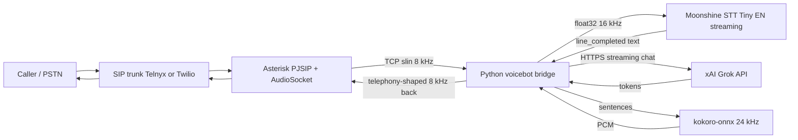

## Plan review (2026-04-25)

**Strengths**

- **End-to-end fit**: AudioSocket gives bidirectional 8 kHz PCM; upsampling to 16 kHz for Moonshine and shaping Kokoro back to narrowband matches how telephony actually sounds. In-process STT/LLM/TTS avoids an extra network hop, which matters on Rockchip.
- **Scope honesty**: Latency table and "pipeline tuning, not retraining" align with the hardware and with Moonshine’s official stance on custom ASR.
- **Incremental delivery**: Build Asterisk + softphone, then add trunk; voicebot on loopback; replay script for headless STT/LLM/TTS iteration.
- **Reuse**: TalkToMe for Grok client patterns; Moonshine’s own STT example for transcriber lifecycle.

**Gaps to close during implementation (not blockers for the plan)**

- **PJSIP trunk** is highly provider-specific. The sketch in §2 is one pattern; many trunks use **registration** (`outbound` + `registrations`) or SRV, not a static AOR `contact=`. Inbound DIDs need the provider’s `identify` match or R-URI handling. Add a "provider appendix" in the repo README with the exact **Telnyx** or **Twilio** pjsip.inc-style blocks once a vendor is chosen.
- **AudioSocket server protocol** must match Asterisk’s implementation byte-for-byte (initial UUID payload, then framed messages). The plan’s type codes are right at a high level; implement from [AudioSocket (Asterisk)](https://docs.asterisk.org/Configuration/Channel-Drivers/AudioSocket/) and test against a minimal channel before wiring STT.
- **Grok model string**: `grok-4-fast-non-reasoning` is a placeholder. Keep **`XAI_MODEL` in `.env` only** and set from current [xAI API docs](https://docs.x.ai/); do not hardcode in application code.
- **menuselect**: `# enable ...` in §1 is a manual step; for automation, document `make menuselect` choices or a small script that uses `menuselect/menuselect` to enable the listed modules without a TTY.
- **Security**: `127.0.0.1:9092` in dialplan is correct; ensure no firewall rule exposes 9092 on WAN. Voicebot is trust-boundary local to Asterisk.

**Verdict**

The plan is **sound and implementable** as written. Tighten trunk and AudioSocket details at implementation time; no architectural U-turns needed.

## Architecture



The whole thing is one Asterisk box plus one always-on Python process. Audio crosses one TCP connection per call (AudioSocket), and `Moonshine` + `kokoro-onnx` run **in-process** in the Python service for the lowest latency.

**Target host:** deploy Asterisk and the voicebot on **Ubuntu Server LTS** (see [ubuntu-asterisk.md](ubuntu-asterisk.md)). Use x86_64 or arm64; x86_64 is often simpler for ONNX wheels. An SBC (e.g. Rockchip) remains possible but is not the default recommendation for this stack.

## Key building blocks already present

- Asterisk source has `app_audiosocket`, `chan_audiosocket`, `res_audiosocket`: [apps/app_audiosocket.c](../apps/app_audiosocket.c) ships 16-bit 8 kHz mono PCM over TCP, exactly what we want.
- Moonshine Voice exposes a streaming `Transcriber` Python API (see `~/workspace/moonshine/python/src/moonshine_voice/transcriber.py`) and a working containerized reference service we can borrow from at `~/workspace/moonshine/examples/python/stt-http-service/` (we won't use HTTP though - in-process is faster).
- Kokoro is available in two forms in your tree: the CLI wrapper `~/workspace/kokoro-tts/` and the underlying `kokoro-onnx` engine. We call `kokoro-onnx` directly from the bridge to stream sentence-by-sentence audio.
- `~/workspace/TalkToMe/backend` already has a working `MoonshineSTT + Grok + Kokoro` triplet for HTTP audio - copy its Grok client and Kokoro voice/options as a starting point.

## Directory layout for the new service

- `~/workspace/voicebot/` (new repo)
  - `voicebot/server.py` - asyncio AudioSocket TCP server on `127.0.0.1:9092`
  - `voicebot/audio.py` - resampling (`soxr`), bandpass, mu-law roundtrip, pre-emphasis
  - `voicebot/stt.py` - Moonshine `Transcriber` wrapper + `TranscriptEventListener`
  - `voicebot/llm.py` - xAI Grok streaming client (reuse `~/workspace/TalkToMe/backend/services/grok*`)
  - `voicebot/tts.py` - `kokoro-onnx` streaming wrapper
  - `voicebot/audiosocket.py` - protocol framing (kind/length/payload, types `0x10` audio, `0x03` DTMF, `0x00` hangup, `0xff` error)
  - `pyproject.toml`, `.env.example`, `README.md`, `systemd/voicebot.service`

## Implementation steps

### 0. Host: Ubuntu

Build and run on **Ubuntu 22.04/24.04 LTS** using this source tree: prerequisites, `ufw`, systemd, and migration from another box are documented in [ubuntu-asterisk.md](ubuntu-asterisk.md).

### 1. Build & install Asterisk

```bash
cd ~/workspace/asterisk
sudo ./contrib/scripts/install_prereq install   # Ubuntu/Debian deps
./bootstrap.sh
./configure --with-pjproject-bundled
make menuselect
# enable: app_audiosocket, chan_audiosocket, res_audiosocket, chan_pjsip,
#         codec_ulaw, codec_alaw, codec_slin16, format_wav, format_pcm
make -j$(nproc) && sudo make install && sudo make samples && sudo make config
sudo systemctl enable --now asterisk
sudo asterisk -rx "module show like audiosocket"
```

On Ubuntu, prefer `make menuselect` (interactive) over only `make menuselect.makeopts` so the listed modules are actually selected.

### 2. SIP trunk + dialplan

Pick a SIP provider with a DID (Telnyx/Twilio Elastic SIP/VoIP.ms). Open UDP 5060 + RTP 10000-20000 (or TLS 5061).

`/etc/asterisk/pjsip.conf` (sketch):

```ini
[transport-udp]
type=transport
protocol=udp
bind=0.0.0.0

[trunk]
type=endpoint
context=from-trunk
disallow=all
allow=ulaw
allow=alaw
direct_media=no
outbound_auth=trunk-auth
aors=trunk-aor

[trunk-auth]
type=auth
auth_type=userpass
username=YOUR_PROVIDER_USER
password=YOUR_PROVIDER_PASS

[trunk-aor]
type=aor
contact=sip:sip.provider.example:5060

[identify-trunk]
type=identify
endpoint=trunk
match=PROVIDER_GATEWAY_IP
```

`/etc/asterisk/extensions.conf`:

```ini
[from-trunk]
exten => _X.,1,NoOp(Inbound to ${EXTEN})
 same => n,Answer()
 same => n,Set(UUID=${SHELL(uuidgen | tr -d '\n')})
 same => n,AudioSocket(${UUID},127.0.0.1:9092)
 same => n,Hangup()
```

Force `ulaw/alaw` only for now so we know the codec exactly. Add a local PJSIP softphone endpoint too for offline testing.

### 3. Voicebot bridge service

Per-connection state machine in `server.py`:

- Accept TCP, read AudioSocket frames, treat `0x10` as 16-bit LE 8 kHz mono PCM.
- Upsample 8 -> 16 kHz with `soxr.resample` (NOT linear interpolation), DC-block, pre-emphasis 0.97, feed `transcriber.add_audio(float32_chunk, 16000)`.
- Register a `TranscriptEventListener`:
  - `on_line_started` -> if TTS is currently playing, **drain the outbound TTS queue (barge-in)**.
  - `on_line_completed` -> append to conversation history, kick off Grok stream.
- Grok streaming (`stream=true`): buffer tokens, dispatch to TTS each time a sentence terminator (`.?!\n`) closes; this keeps first-byte audio under ~600 ms.
- Kokoro: `kokoro-onnx` with voice `af_heart` (clear, mid-range, narrowband-friendly), 24 kHz output, streaming chunks.
- Outbound shaping (in `audio.py`): 24 kHz -> 8 kHz `soxr`, Butterworth bandpass 300-3400 Hz (4th order), optional `audioop.lin2ulaw`/`ulaw2lin` roundtrip for G.711 character, RMS-normalize to about -3 dBFS, frame to 320-byte 20 ms chunks, send as AudioSocket `0x10` frames at real-time pace.
- Hangup: AudioSocket `0x00` (or socket close) -> `transcriber.stop()`, cancel TTS, flush audio log.
- Persist `/var/lib/voicebot/calls/<uuid>/{caller.wav,bot.wav,transcript.json}` for QA (configurable retention).

### 4. Pipeline tuning for telephone voice (no model retraining)

This is the substitute for actual fine-tuning. Concrete knobs:

- **Moonshine**: Tiny English Streaming model (lowest latency on ARM64); `vad_threshold=0.6`, `vad_window_duration=0.4`, `vad_max_segment_duration=10`, `max_tokens_per_second=6.5`, `update_interval=0.5`. Always upsample 8 kHz -> 16 kHz with a proper polyphase resampler before feeding it. Save `save_input_wav_path` for the first few calls to verify quality.
- **Kokoro**: telephony EQ (300-3400 Hz bandpass), 8 kHz target rate, mu-law roundtrip, `speed=1.05`, voice `af_heart` or `am_michael`. Avoid breathy voices that mush in narrowband.
- Document that **real** fine-tuning later means: Moonshine via the community fork [pierre-cheneau/finetune-moonshine-asr](https://github.com/pierre-cheneau/finetune-moonshine-asr) on telephony-augmented LibriSpeech/CommonVoice (8 kHz codec sim, room IR, additive noise); Kokoro voice fine-tune via upstream `hexgrad/kokoro` training scripts on a GPU box. Both are GPU-bound and out of scope for a small edge device; use a separate training machine if you go that route.

### 5. Run/dev workflow

- `~/workspace/voicebot/.env`: `XAI_API_KEY`, `XAI_MODEL=grok-4-fast-non-reasoning`, `KOKORO_VOICE=af_heart`, `MOONSHINE_LANGUAGE=en`, `MOONSHINE_MODEL_ARCH=tiny-streaming`, `LOG_LEVEL=INFO`.
- `systemd/voicebot.service` enables and starts the asyncio server.
- Local Linphone/Zoiper softphone registers against the same Asterisk for end-to-end dev calls before exposing the trunk.
- `scripts/replay-wav.py` to feed a known WAV through the AudioSocket protocol against `127.0.0.1:9092` so you can iterate on STT/LLM/TTS without dialing.
- Smoke checks: `curl /health` on Moonshine if you also run the HTTP service for diagnostics; `asterisk -rx "pjsip show endpoints"`; `asterisk -rx "core show channels"` during a live call.

## Honest latency budget (typical Ubuntu host or similar)

- Moonshine Tiny EN streaming finalize: ~250-500 ms after the caller stops talking.
- Grok streamed first token: ~300-700 ms.
- Kokoro first-sentence audio: ~200-500 ms.
- Total perceived "I stopped talking -> bot starts talking": ~1.0-1.7 s. Tunable downward by streaming Grok output mid-sentence at the cost of prosody.

## Risks / verify during build

- ONNX Runtime wheels for `moonshine-voice` and `kokoro-onnx` on your architecture (x86_64 is usually frictionless; on ARM64 verify `pip install moonshine-voice` / `kokoro-onnx` before locking the host choice).
- `chan_pjsip` requires `pjproject` - use `--with-pjproject-bundled` if system pjproject isn't available.
- NAT: if Asterisk isn't on a public IP, set `external_media_address`/`external_signaling_address` and configure a reachable RTP range with the trunk provider.
- xAI rate limits: keep model on a non-reasoning Grok variant for latency; swap up later if quality > latency.
